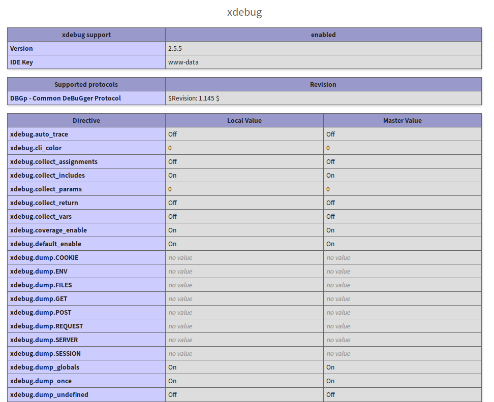

`phpstorm`找激活码太心累，开始换用`vs code`

所幸配置xdebug更加方便

##### 1. 安装php-xdebug插件
搜索并安装vs的php-xdebug插件，安装成功后重启vs code.
##### 2. phpinfo
查看phpinfo是否安装xdebug
```
<?php
    echo phpinfo();
```
输出的信息中搜索xdebug.
如果没有則需要用命令安装

```
apt-get install php-xdebug
service php7.0-fpm reload //重启php-fpm服务，版本号修改为自己环境的php版本
```

重启后再次确认下`phpinfo`中是否有xdebug扩展，一般有xdebug配置出现。

##### 3. php.ini
修改php.ini配置文件
```
[XDebug]
xdebug.remote_enable = 1
xdebug.remote_autostart = 1
```

##### 4. vs code配置文件
打开vs，进入调试页面。选择添加调试，可以看到默认生成了两个配置文件，修改下配置文件里的端口即可。

PS : 端口是xdebug使用，不是项目端口。


```
{
    // 使用 IntelliSense 了解相关属性。
    // 悬停以查看现有属性的描述。
    // 欲了解更多信息，请访问: https://go.microsoft.com/fwlink/?linkid=830387
    "version": "0.2.0",
    "configurations": [
        {
            "name": "Listen for XDebug",
            "type": "php",
            "request": "launch",
            "port": 9000 //端口冲突可更改
        },
        {
            "name": "Launch currently open script",
            "type": "php",
            "request": "launch",
            "program": "${file}",
            "cwd": "${fileDirname}",
            "port": 9000
        }
    ]
}
```


